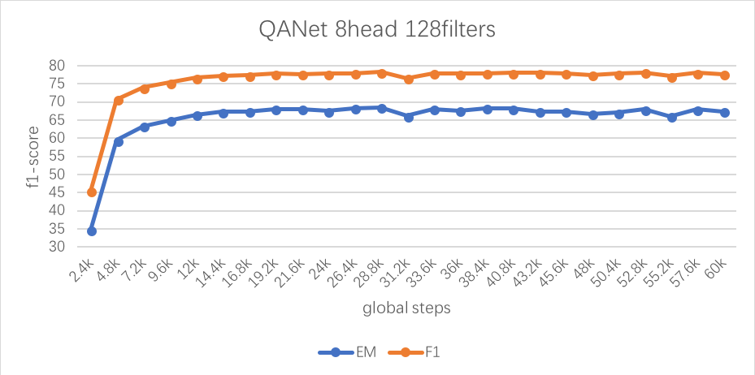

## QANet in keras
QANet: https://arxiv.org/abs/1804.09541

This keras model refers to QANet in tensorflow (https://github.com/NLPLearn/QANet). ~~and the self-attention & position embedding are used from (https://kexue.fm/archives/4765, https://github.com/bojone/attention)~~. Now the self-attention & position embedding are also revised from (https://github.com/NLPLearn/QANet).
> We find that the conv based multi-head attention in tensor2tensor (https://github.com/NLPLearn/QANet/blob/master/layers.py) performs 3%~4% better than the multiplying matrices based one in (https://github.com/bojone/attention/blob/master/attention_keras.py).

## Pipline
1. Download squad data from (https://rajpurkar.github.io/SQuAD-explorer/).

2. Run `preprocess.ipynb` and `handcraft.ipynb`(if you need) to get npys of the preprocessed data and handcraft features.

3. Run `train_QANet.py` to start training.

## Updates
- [x] Add EMA (with about 3% improvement)
- [x] Add multi gpu (speed up)
- [x] Support adding handcraft features
- [x] Revised the MultiHeadAttention and PositionEmbedding in keras
- [x] Support parallel multi-gpu training and inference
- [x] Add layer dropout and revise the dropout bug (with about 2% improvement)
- [x] Update the experimental results and related hyper-parameters (in `train_QANet.py`)
- [x] Revise the output Layer `QAoutputBlock.py`(with about 1% improvement)
- [x] Replace the **BatchNormalization** with the **LayerNormalization** in `layer_norm.py`(the improvement of this change is unknow, look for results...)
- [x] Add **slice operation** to QANet (double speed up, but now use train_on_batch instead of fit_generator)
- [x] Add Cove (looking for results)
- [ ] Add Elmo in keras
- [ ] Add data augmentation

I find that EMA in keras is hard to implement with GPU, and the training speed is greatly affected by it in keras. Besides, it's hard to add the slice op in keras too, so the training speed is further slower(cost about twice as much time compared with the optimized tensorflow version...). Moreover, there is also 2% gap of keras compared with the tensorflow version(https://github.com/NLPLearn/QANet).

## Results
Result on dev set of squad (no cove and elmo)
